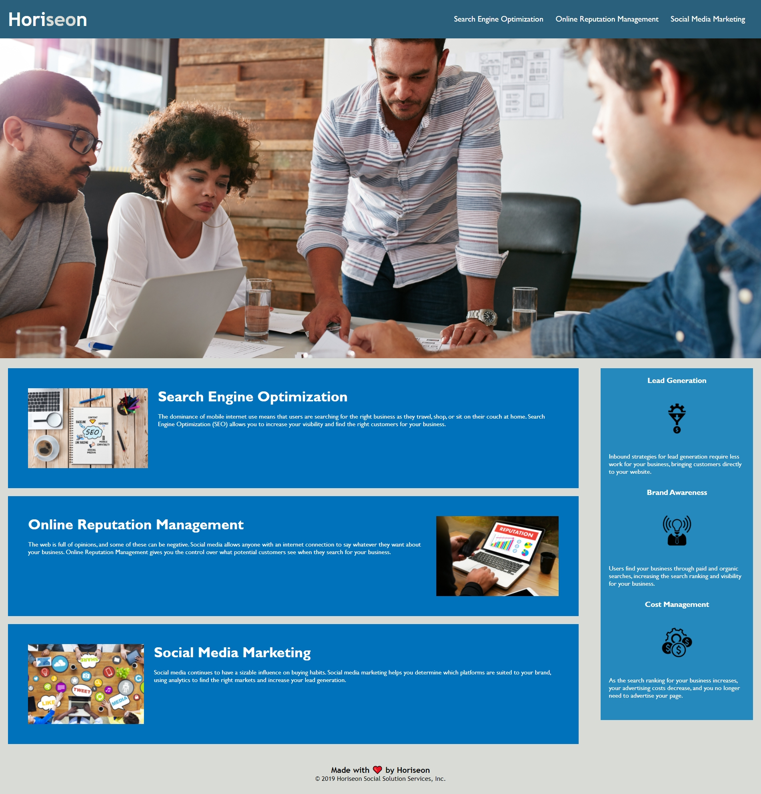

# <Marketing-Company>

## Description

Horiseon company requested changes a refactoring for thier website homepage to make it user-friendly that follows accessibility standards so it can be optimized for search engines!
The changes does not give any change to the design, I only changed on makeing HTML elements to semantic HTML elements!

- What problem does it solve?

1. HTML elements were replaced with semantic HTML elements.
2. rplaced div with classes.
3. Alt discreption was added to images
4. addeing notes for where the changes was made!

## Usage

This site was built using [VSC](https://raghadmalallah.github.io/marketing-company/).

